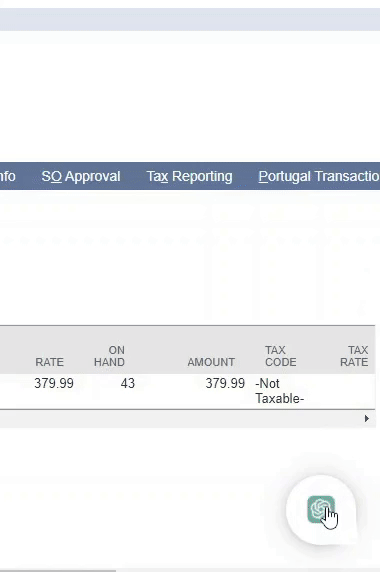
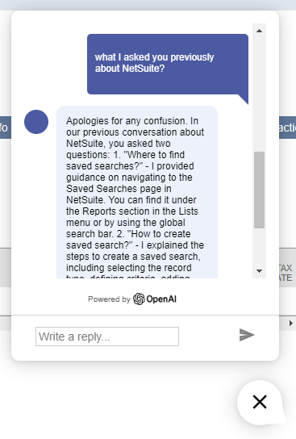
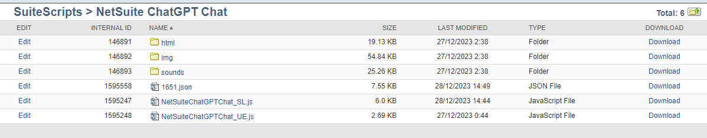
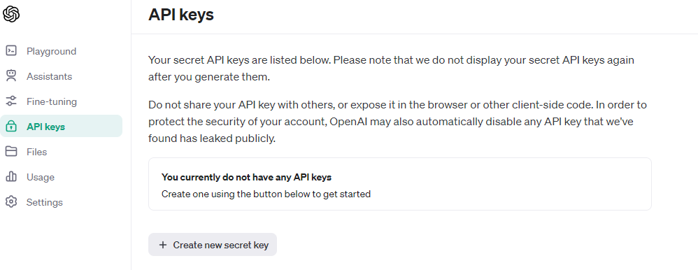
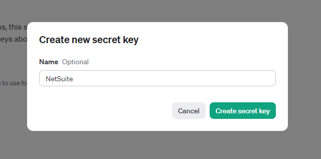
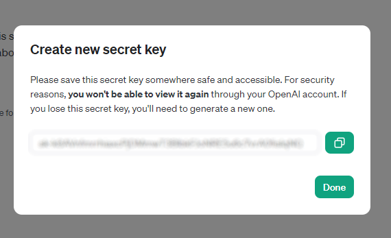
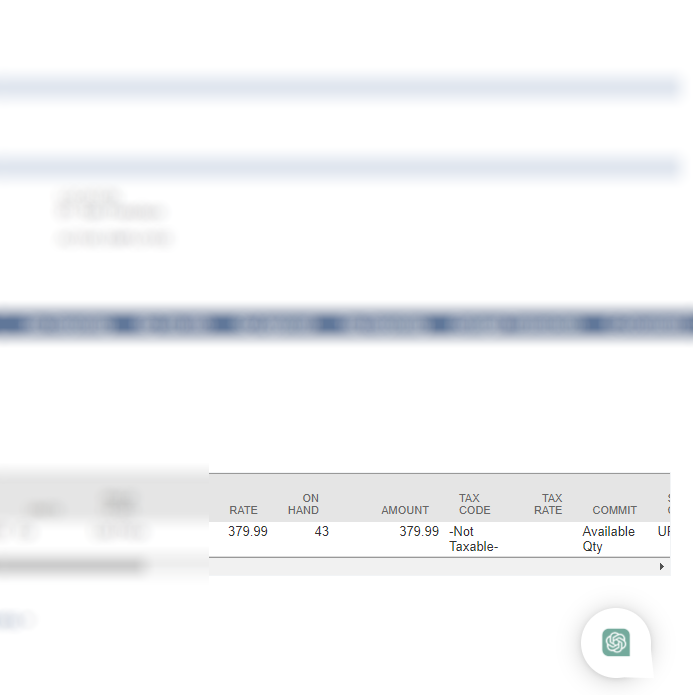
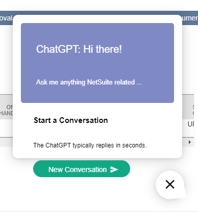
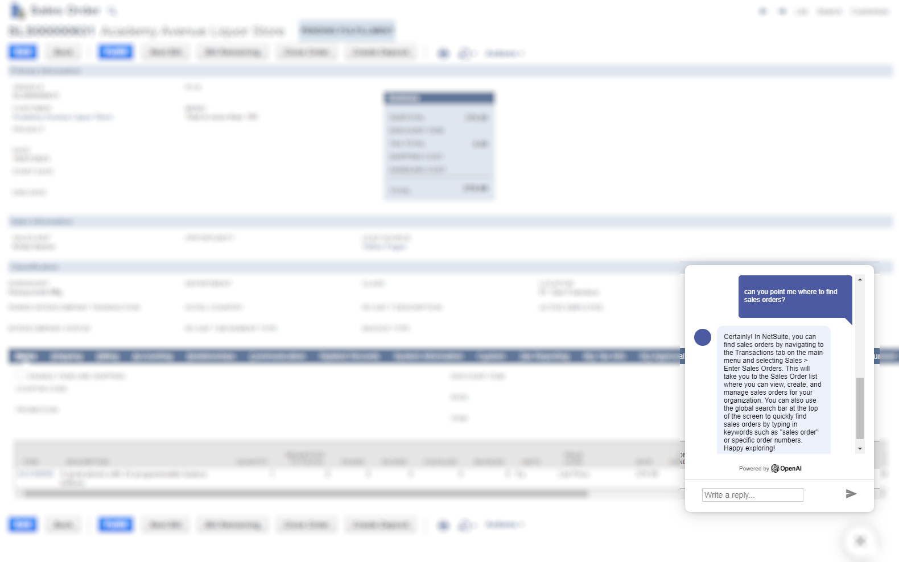
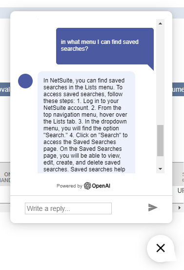

# NetSuite ChatGPT Chat
Ask ChatGPT NetSuite questions directly from your transactions.

## Example usage

## What if ChatGPT refuses to complete requested tasks or produce wrong answers? Maybe its seasonal depression?

## Remembering of previous messages / history / preserving context 
- Since version 1.1.0 the Service Suitelet is sending back all messages from the previous conversation.
- Even if you log out from NetSuite and come back, you can ask what you asked previously.
  - 
- History of previous conversation is preserved in the Script Folder in format UserID.json

## Architecture
- NetSuiteChatGPTChat_UE Uservent Script
  - Adds INLINEHTML field on beforeLoad
  - Content including html, js, css is injected from ./html/chat.html file into INLINEHTML field
  - User Event is deployed on Sales Order record and chat popup will show on scriptContext.UserEventType.VIEW
- NetSuiteChatGPTChat_SL Suitelet Script
  - Acts like service to connect to OpenAI API
  - Responses from OpenAI -> NetSuiteChatGPTChat_SL are fetched and rendered in the chat popup by chat.html

## How to switch between ChatGPT 3.5 / ChatGPT 4?
- In NetSuiteChatGPTChat_SL
  - const OPENAI_MODEL = OPENAI_MODELS.GPT3; for ChatGPT 3.5-Turbo (Default)
  - const OPENAI_MODEL = OPENAI_MODELS.GPT4; for ChatGPT 4 (May answer slower)

## Considerations
- May break NetSuite functionalities / view
- Not a production version
- Not well tested
- Use at your own risk

## How to Setup
- Put your OpenAI API Key in NetSuiteChatGPTChat_SL in OPENAI_API_KEY const
- System prompt can be customized, currently "You are a NetSuite assistant, skilled in NetSuite concepts with creative flair."

## How to obtain OpenAI API Keys
- Go to https://platform.openai.com/api-keys
- Click on "+Create new secret key"

- Enter name E.g. NetSuite

- Click on "Create secret key" & copy secret

- Edit NetSuiteChatGPTChat_SL.js and put secret in OPENAI_API_KEY const

## Credits
- Popup-chat-window (https://github.com/KRISHNAPRASADEK/Popup-chat-window)

## Screenshots

